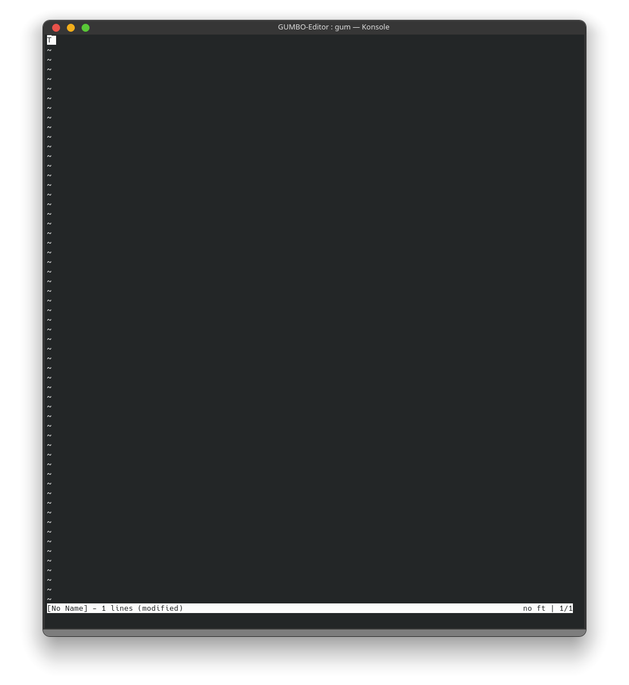

# <strong>GUMBO editor</strong>

Simple editor built upon [kilo](https://github.com/antirez/kilo) editor idea but expanded to use ncurses library.

# Features

GUMBO is a simple text editor to use in the easiest ways possible.
You can simply write edit and text as you please.
It has support for <strong>C/C++</strong> and <strong>Python</strong> syntax(updating it as we go).

# Compile and run

Make sure you have <strong>g++, CMake, and ncurses</strong>(some distros have it by default some not) installed on your system.  
All you need to do is run `build.sh` script and it will build everything into `build` folder.
To run it all you need to do is to navigate to
`cd build/src`
and run it
`./gum <filename>`
or just
`./gum`
as it does not need file argument to
run or simply run it by typing
`./build/src/gum <filename>`
or
`/build/src/gum`.

# Problems

As GUMBO is still in development there is the possibility of problems so if you encounter one <strong>feel free</strong> to open the issue.
